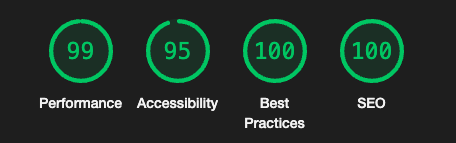
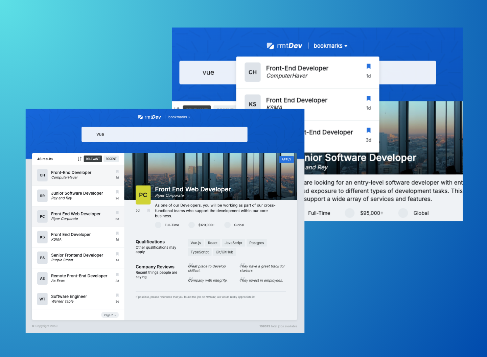

# rmtDev - Discover Your Next Tech Job! 🚀

## 🌟 Features

- **Search by Technology**: Find job listings tailored to your favorite technologies. Simply type keywords like `Vue`, `React`, or `TypeScript` and discover relevant opportunities.
- **Bookmark Jobs**: Save your favorite job listings to your bookmarks using local storage and access them anytime.
- **Share Job Links**: Share job listings with friends by copying the link directly from the browser's address bar.
- **Sort Results**: View search results sorted by `Recent` or `Relevance` to suit your preferences.
- **Interactive UI**: Enjoy a clean and interactive user experience with visually appealing design elements.

## 🛠️ Technologies Used

- **Vue 3**: Lightweight and performant framework for building user interfaces.
- **TanStack Vue Query**: Effortless state management and data fetching.
- **Axios**: Simplified HTTP requests for fetching job listings.
- **Vue3-Toastify**: Beautiful toast notifications for better user feedback.
- **Vite**: Lightning-fast build tool for modern web projects.
- **TypeScript**: Enhance reliability with type-safe development.

## 🌐 Live Demo

[Visit rmtDev](https://rmtdevs.netlify.app)

## 🌟 Lighthouse Score

  
    

## 🌄 Preview

  
    

## Author

- **LinkedIn**: [Gümrah Sindar](https://www.linkedin.com/in/gumrahsindar/)
